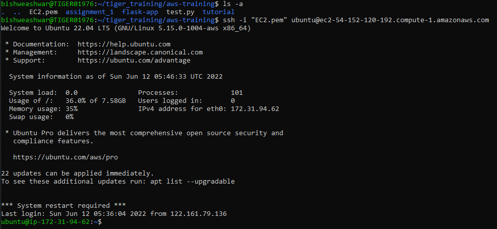
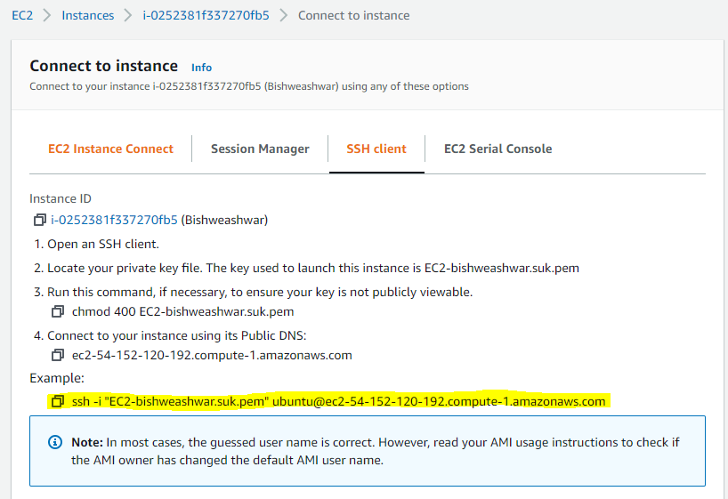
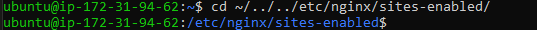
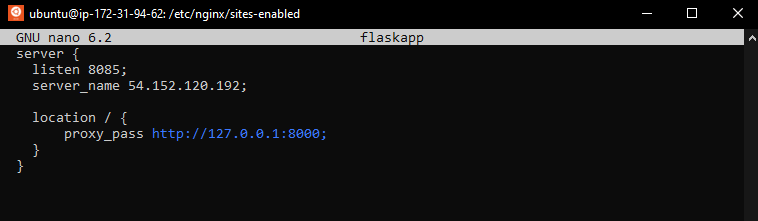
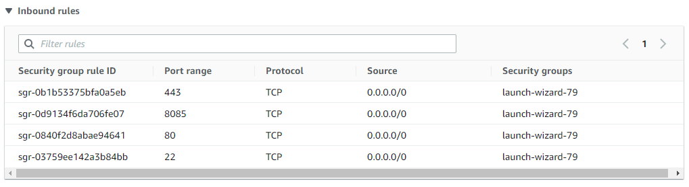
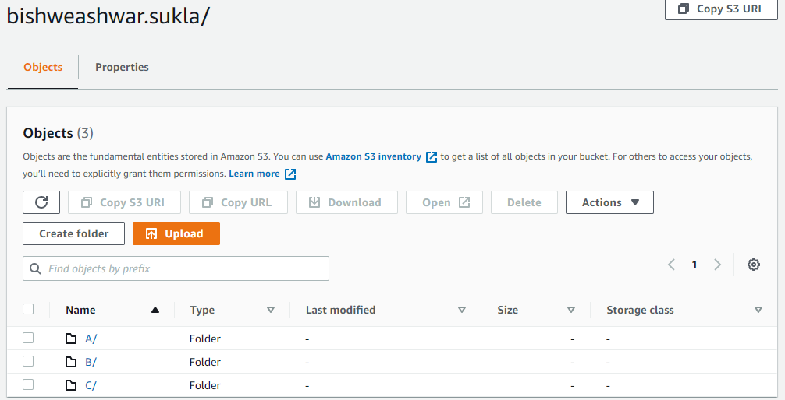

## Deployed-Flask-APP link 
http://54.152.120.192:8085/

## Tags Used
name	:bishweashwar-ec2
owner	:bishweashwar.suk@tigeranalytics.com
team	:mle
project	:aws-training

## Steps 

1. Create your instance (I preferred Ubuntu Server 22.04 LTS (HVM) ,SSD Volume type ;as Amazon Machine Image- AMI)

2. After successfully creating your instance , connect to your instance. I used CLI for this.

3. Paste the below command where your key is stored.
ssh -i "EC2.pem" ubuntu@ec2-54-152-120-192.compute-1.amazonaws.com

You can get this command in after creating your instance and clicking on Connect Tab then SSH client.

4. Sometimes you will get permission denied (0644 error). Use the below command

    chmod 400 EC2.pem

For other error google it.

5. After this you need to install every package required by your after inside instance.

6. Use the folloing command:
    i. sudo apt-get update.

    ii. sudo apt-get install python3.

    iii. sudo apt-get install python3-pip.

    iv. pip3 install flask.

    v. sudo apt-get install nginx (python web server).

    vi. sudo apt-get install gunicorn (python web server getway interface or wxgi )
    
    Now you have to setup AWS configuration also

    vii. pip3 install awscli.

    viii. aws configure (insert your key, id region) & after this open credentials inside .aws folder and  save your profile name inside  that.

    ix. cd ~/../../etc/sites-enabled/

    

    x. sudo nano flaskapp (for configuring nginx server)

      server {
        listen 8085; //Use any port from which you want to get traffic from internet . 
                    //By default 80  is their but for assignment purpose I have used 8085 (TCP)
                    //In Security group of your instance you also need  to add 8085 port.
        server_name 54.152.120.192; //Paste your Public IP here
        location / {
        proxy_pass http://127.0.0.1:8000;
            }
        }

    

        save the file (Ctrl + X -> press ENTER key)
        
    xi. sudo service nginx restart.
    
    xii. Now get inside Software folder. If it is in local machine then use below command to transfer into EC2 instance:

    exit (to stop instance)
    ## for directories
    scp -i EC2.pem -r directory_location/ ubuntu@ec2-54-152-120-192.compute-1.amazonaws.com:~/.   
    
    ## for transfering files
    scp -i EC2.pem file_location/ ubuntu@ec2-54-152-120-192.compute-1.amazonaws.com:~/.
    
    xiii. Connect to your instance. Get into your software folder and run below command (Name your software file app.py)

    ## Run you app using gunicorn3
    gunicorn3 app:app

    xiv. Now  copy your public IP from instance page and run it 
    
    
    ## My public IP & deployed-flask-app link
    http://54.152.120.192:8085/ 

    xv. Close the server using 
    Ctrl + C
    
    xv. nohup gunicorn app:app & 
        press ENTER key

    After running above command you need not run server in background always.

    ## Remember that don't stop intance in from AWS page . If you restart it, your public IP will get change and you have  to mention that IP inside your flaskapp nginx server configuration file again.

    ## Security Group Image
    

    ## s3 Bucket folders
    